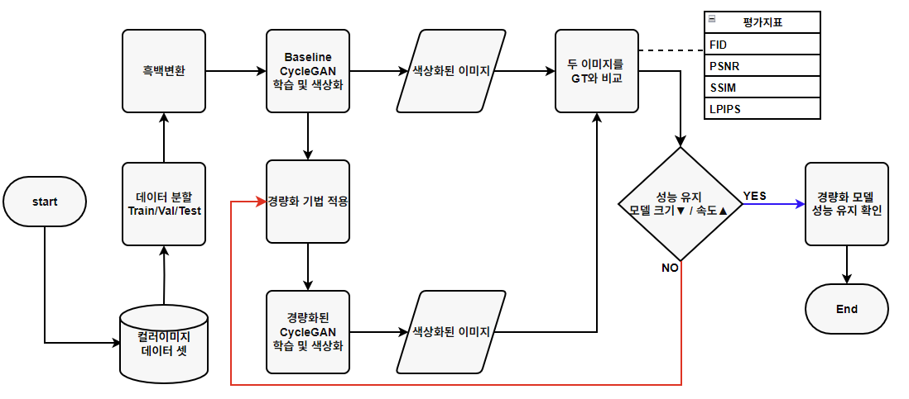
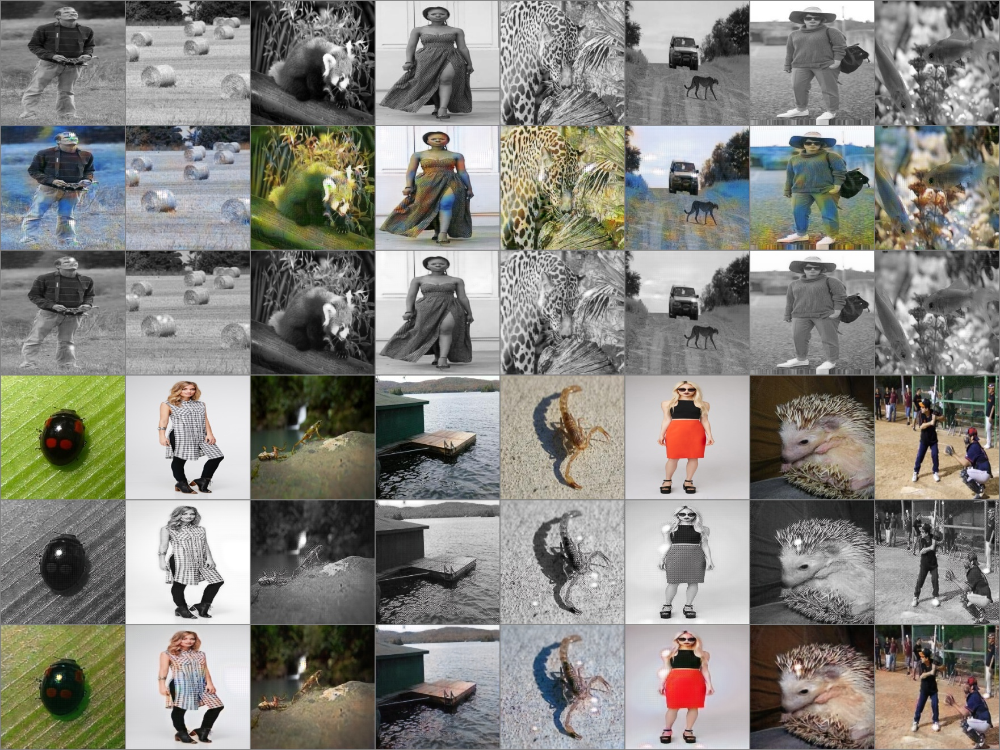
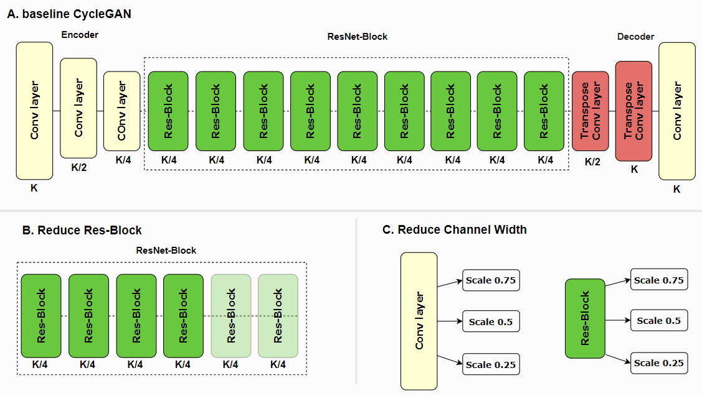
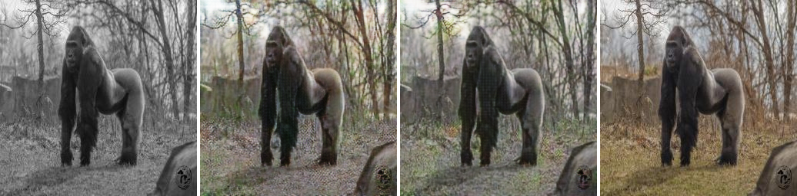
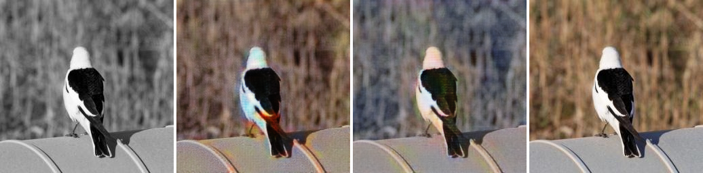
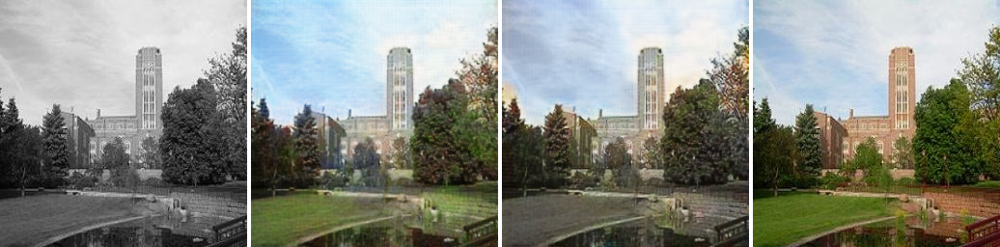
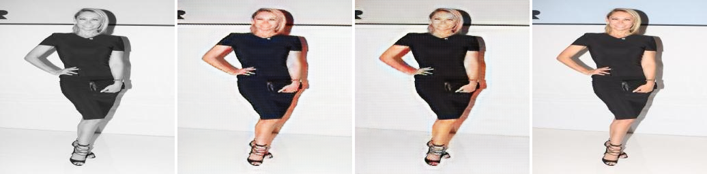

<div align="center">

# Lightweight CycleGAN

**Performance Preservation and Processing Speed Improvement of CycleGAN-Based Colorization**

Grayscale → color image translation with an unpaired CycleGAN, made **2× faster** and **~52% smaller** — without losing quality.

**English** · [한국어](README.ko.md)

<sub>KAICTS 2025 Autumn Conference · Konyang University</sub>

</div>

---

## TL;DR

The standard CycleGAN generator (9 residual blocks, ~11.4M parameters) is accurate but too heavy for real-time or on-device use. We systematically shrink it along three axes — **residual depth**, **channel width**, and **depthwise separable convolutions** — and measure what each one costs in quality.

The result is counter-intuitive and useful: **cutting the generator from 9 to 4 residual blocks makes the model smaller, faster, *and* better.**

| Metric | Baseline (9 blocks) | **Lightweight (4 blocks)** | Change |
|---|---:|---:|:--|
| Params | 11.37 M | **5.48 M** | 🔻 52% |
| FLOPs | 113.78 G | **50.90 G** | 🔻 55% |
| FPS | 169.78 | **272.90** | 🔺 1.61× |
| PSNR ↑ | 20.207 | **21.111** | 🔺 +0.904 |
| SSIM ↑ | 0.816 | **0.852** | 🔺 +0.036 |
| LPIPS ↓ | 0.279 | **0.235** | 🔻 −0.044 |

> Need something even smaller? The `4 blocks + width ×0.25` variant runs at **355 FPS with 0.34M parameters** — 33× smaller than the baseline — while still holding PSNR at 20.1.

---

## Contents

1. [Motivation](#1-motivation)
2. [Method](#2-method)
3. [Dataset](#3-dataset)
4. [Training setup](#4-training-setup)
5. [Results](#5-results)
6. [What we learned](#6-what-we-learned)
7. [Limitations & future work](#7-limitations--future-work)
8. [Reproducing](#8-reproducing)
9. [Citation & credits](#9-citation--credits)

---

## 1. Motivation

Supervised image-to-image models such as **Pix2Pix** need *paired* data — the same scene in both domains. For old photographs, archival footage, and historical records that pairing simply does not exist, and creating it is expensive.

**CycleGAN** removes that requirement by learning from *unpaired* collections, which makes it a natural fit for colorization. But prior work has optimized almost entirely for output quality: the default generator stacks 9 residual blocks and needs ~114 GFLOPs per 256×256 frame, which rules out real-time use on mobile phones, edge devices, and browser-side demos.

**This project asks a different question:** how much of that generator is actually doing work? We keep the CycleGAN training recipe fixed and compress only the generator, then measure quality and speed together.

<p align="center">
  
</p>

<p align="center"><sub>Color images → grayscale conversion → train baseline and compressed generators under identical settings → compare each output against the ground-truth color image with FID / PSNR / SSIM / LPIPS, iterating until a variant keeps quality while reducing size and latency.</sub></p>

---

## 2. Method

### 2.1 CycleGAN recap

CycleGAN trains two generators and two discriminators at once. An image from domain A is translated to B and then back to A; the **cycle-consistency loss** forces the round trip to return the original, so structure is preserved even though no paired supervision exists.

<p align="center">
  
</p>

<p align="center"><sub>Top group: real A → fake B → reconstructed A′. Bottom group: real B → fake A → reconstructed B′. Training minimizes ‖A − A′‖ and ‖B − B′‖.</sub></p>

### 2.2 Three compression axes

We keep the encoder–decoder skeleton and the loss functions untouched, and vary only the generator:

<p align="center">
  
</p>

| # | Axis | What changes |
|---|---|---|
| **A** | *Baseline* | `Conv ×3 (encoder) → 9 × Res-Block → Transpose-Conv ×2 → Conv (decoder)` |
| **B** | **Residual depth** | 9 → **6** → **4** residual blocks |
| **C** | **Channel width** | Every conv and residual block scaled by **×0.75 / ×0.5 / ×0.25** |
| **D** | **Depthwise separable** | Residual blocks rebuilt as depthwise-separable conv + 1×1 bottleneck |
| **E** | **Combined** | 4 blocks **+** channel scaling (×0.25 / ×0.5 / ×0.75) |

Every variant is trained from scratch with the exact same data, resolution, optimizer, schedule and seed, so the differences in the results table are attributable to architecture alone.

---

## 3. Dataset

To avoid a model that only knows how to colorize one kind of subject, three public datasets were merged into a single domain-diverse corpus.

| Source | Sampling | Images |
|---|---|---:|
| [Animals Detection Images](https://www.kaggle.com/datasets/antoreepjana/animals-detection-images-dataset) | 50 random images × 80 classes | ~4,000 |
| [SUN397 (50-50 split)](https://www.kaggle.com/datasets/lash45/sun397-50-50) — places | 10 random images × 397 classes | ~3,970 |
| [StyleGAN-Human](https://stylegan-human.github.io/data.html) | random sample | ~4,000 |
| **Total** | | **~12,000** |

**Preprocessing**

- All images resized to **256 × 256** (fixed model input size).
- Each color image is converted to grayscale to form the paired-for-evaluation counterpart; training itself remains unpaired.
- Split **70% train / 20% validation / 10% test**. Every number reported below is measured on the held-out test split.

### Why merge domains?

The same baseline architecture was trained twice — once on animals only, once on the merged corpus:

| Metric | Animal only | Merged |
|---|---:|---:|
| Params / FLOPs | identical | identical |
| PSNR ↑ | 19.656 | **20.207** |
| SSIM ↑ | 0.625 | **0.816** |
| LPIPS ↓ | **0.258** | 0.279 |
| Colorfulness ↑ | 19.104 | **29.556** |

The animal-only model produces muted, low-saturation output. The merged model scores far higher on colorfulness (19.1 → 29.6) and visibly produces richer, more plausible colors — so **the merged dataset is used as the baseline for all subsequent experiments**.

---

## 4. Training setup

Identical for the baseline and every lightweight variant:

| Setting | Value |
|---|---|
| Input resolution | 256 × 256 |
| Batch size | 16 |
| Epochs | 100 (50 constant LR + 50 linear decay) |
| Optimizer | Adam — `lr = 2e-4`, `β₁ = 0.5`, `β₂ = 0.999` |
| Loss weights | `λ_cycle = 10.0`, `λ_identity = 0.5` |
| Seed | 42 |
| Data | Merged (places + animals + humans) |

**Metrics.** PSNR and SSIM for pixel and structural fidelity, LPIPS for perceptual distance, and FPS for inference throughput. Params and FLOPs are reported for the generator.

---

## 5. Results

### 5.1 Full ablation

| Metric | Baseline | 6 block | **4 block** | Scale 0.75 | Scale 0.5 | Scale 0.25 | Depthwise | 4b + ×0.25 | 4b + ×0.5 | 4b + ×0.75 |
|---|---:|---:|---:|---:|---:|---:|---:|---:|---:|---:|
| **Params (M)** | 11.37 | 7.84 | **5.48** | 6.40 | 2.85 | 0.72 | 0.73 | 0.34 | 1.37 | 3.08 |
| **FLOPs (G)** | 113.78 | 70.30 | **50.90** | 31.70 | 6.40 | 0.42 | 12.40 | 3.70 | 3.30 | 16.40 |
| **FPS ↑** | 169.78 | 222.00 | **272.90** | 195.55 | 195.74 | 206.22 | 158.40 | 355.26 | 331.71 | 331.31 |
| **PSNR ↑** | 20.207 | 20.683 | **21.111** | 20.698 | 19.993 | 17.885 | 19.994 | 20.148 | 19.905 | 20.587 |
| **SSIM ↑** | 0.816 | 0.828 | **0.852** | 0.837 | 0.792 | 0.687 | 0.772 | 0.797 | 0.802 | 0.844 |
| **LPIPS ↓** | 0.279 | 0.266 | **0.235** | 0.248 | 0.271 | 0.256 | 0.320 | 0.305 | 0.264 | 0.246 |

Best quality on all three image metrics **and** a 1.6× speedup: **4 residual blocks**.

### 5.2 Qualitative comparison

Left → right: **Input (grayscale)** · **Baseline CycleGAN** · **Lightweight (4 block)** · **Ground truth**

<p align="center">
  <br/>
  <br/>
  <br/>
  
</p>

The baseline restores color stably. Despite the simplified structure, the lightweight model keeps object boundaries crisp and produces comparably natural color — with noticeably less of the high-frequency speckling visible in the baseline outputs.

---

## 6. What we learned

**Reducing residual depth is free — and then some.**
9 → 6 → 4 blocks monotonically reduced compute *and* improved PSNR / SSIM / LPIPS. For 256×256 colorization the 9-block stack is over-parameterized; the extra depth mostly adds artifacts.

**Reducing channel width buys speed at a real cost in quality.**
×0.75 stays close to baseline, but ×0.5 and especially ×0.25 (PSNR 17.885) degrade clearly. Width carries the color representation; depth does not.

**Combining both is the best trade-off for tight budgets.**
`4 block + ×0.75` reaches 331 FPS with 3.08M params while still beating the baseline on PSNR, SSIM and LPIPS. `4 block + ×0.25` pushes to 355 FPS at 0.34M params — 33× smaller than baseline — for a modest quality drop.

**Depthwise separable convolutions did not pay off here.**
At 0.73M params the depthwise variant was the *slowest* model measured (158 FPS), and it had the worst LPIPS of any variant. A likely explanation is that depthwise convolutions are memory-bound on GPU, so the FLOP savings do not translate into wall-clock speed.

---

## 7. Limitations & future work

- **Metrics ≠ perception.** Several variants improved on PSNR/SSIM/LPIPS while still looking unnatural to human viewers. These metrics do not fully capture human visual judgment; future work will optimize explicitly for perceptual quality.
- **More and better data.** ~12,000 images is modest for a task this open-ended. Expanding the corpus, and its diversity of lighting and subject matter, is the most direct path to better output.
- **On-device validation.** Additional compression (quantization, pruning, distillation) and measured latency on real mobile and edge hardware — not just desktop GPU FPS — are the next step toward the target applications: educational material, cultural-heritage restoration, and mobile apps.

---

## 8. Reproducing

The experiments build on the official PyTorch implementation from the CycleGAN authors:

```bash
git clone https://github.com/junyanz/pytorch-CycleGAN-and-pix2pix
cd pytorch-CycleGAN-and-pix2pix
pip install -r requirements.txt
```

**Baseline**

```bash
python train.py \
  --dataroot ./datasets/gray2color \
  --name cyclegan_baseline \
  --model cycle_gan \
  --netG resnet_9blocks \
  --load_size 256 --crop_size 256 \
  --batch_size 16 \
  --n_epochs 50 --n_epochs_decay 50 \
  --lr 0.0002 --beta1 0.5 \
  --lambda_A 10.0 --lambda_B 10.0 --lambda_identity 0.5
```

**Lightweight variants.** `models/networks.py` defines `ResnetGenerator(..., n_blocks=9)` and `ngf` (base channel width). The variants above correspond to:

| Variant | Change |
|---|---|
| 6 block / 4 block | `n_blocks = 6` / `n_blocks = 4` |
| Scale ×0.75 / ×0.5 / ×0.25 | `ngf = 48` / `32` / `16` (from the default `64`) |
| Depthwise | replace the `3×3` convs inside `ResnetBlock` with depthwise-separable conv + `1×1` bottleneck |
| Combined | both `n_blocks` and `ngf` together |

> **Note.** This repository currently hosts the report, figures and measurements for the study. The generator modifications are small, local edits to the upstream `networks.py` as described above.

---

## 9. Citation & credits

### Paper

> Minsu Kang†, Junhyeok Kang†, Seungki Jang†, Junhwa Kim.
> **"Performance Preservation and Processing Speed Improvement of CycleGAN-Based Colorization"** (CycleGAN 기반 색상화 성능 유지와 처리 속도 향상).
> *KAICTS 2025 Autumn Conference*, Korea Artificial-Intelligence Convergence Technology Society, Nov 2025.
> † Equal contribution.

```bibtex
@inproceedings{kang2025lightweightcyclegan,
  title     = {Performance Preservation and Processing Speed Improvement of CycleGAN-Based Colorization},
  author    = {Kang, Minsu and Kang, Junhyeok and Jang, Seungki and Kim, Junhwa},
  booktitle = {Proceedings of the KAICTS Autumn Conference,
               Korea Artificial-Intelligence Convergence Technology Society},
  year      = {2025}
}
```

### Authors

| Name | Affiliation |
|---|---|
| 강민수 (Minsu Kang)† — *presenter* | Dept. of Medical Artificial Intelligence, Konyang University |
| 강준혁 (Junhyeok Kang)† | Dept. of Medical Artificial Intelligence, Konyang University |
| 장승기 (Seungki Jang)† | Dept. of Medical Artificial Intelligence, Konyang University |
| 김준화 (Junhwa Kim) | Dept. of Artificial Intelligence, Konyang University |

### Acknowledgment

This work was supported by the Institute of Information & Communications Technology Planning & Evaluation (IITP) grant funded by the Korea government (MSIT), under the SW-Oriented University Program (**2024-0-00047**).

### References

1. E. Lin. *Comparative Analysis of Pix2Pix and CycleGAN for Image-to-Image Translation.* Highlights in Science, Engineering and Technology, 39:915–925, 2023.
2. J.-Y. Zhu, T. Park, P. Isola, A. A. Efros. *Unpaired Image-to-Image Translation Using Cycle-Consistent Adversarial Networks.* ICCV 2017, pp. 2242–2251.
3. S. Nyamathulla, N. Veeranjaneyulu. *Analysis of Pix2Pix and CycleGAN for Image-to-Image Translation: A Comparative Study.* ICSPCRE 2024, pp. 1–6.
4. R. Steele. *Peak signal-to-noise ratio formulas for multistage delta modulation with RC-shaped Gaussian input signals.* Bell System Technical Journal, 61(3):347–362, 1982.
5. Z. Wang, A. Bovik, H. Sheikh, E. Simoncelli. *Image Quality Assessment: From Error Visibility to Structural Similarity.* IEEE TIP, 13(4):600–612, 2004.
6. R. Zhang, P. Isola, A. A. Efros, E. Shechtman, O. Wang. *The Unreasonable Effectiveness of Deep Features as a Perceptual Metric.* CVPR 2018, pp. 586–595.

### Related work by the same team

- [Gray-to-color-colorization-pix2pix-based](https://github.com/neodle/Gray-to-color-colorization-pix2pix-based) — the paired, Pix2Pix-based predecessor to this study.
